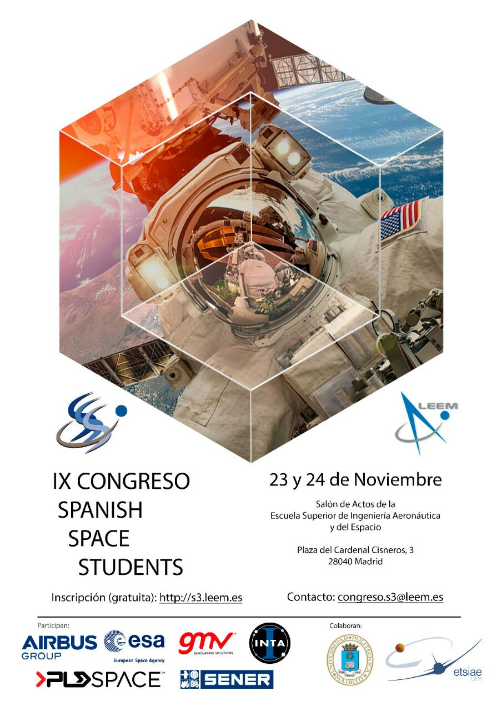
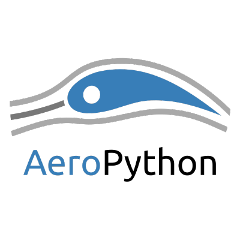

# [AeroPython: programando en Ingeniería Aeroespacial](http://s3.leem.es/#schedule)
## Viernes 24 de noviembre de 2017 - 16:00-16:45 h - Madrid, España

### Equipo AeroPython 
Alex Saez
Mabel Delgado
Siro Moreno
Jesús Martos

## Descripción
Aprovechando la oportunidad que nos brinda el IX Congreso Spanish Space Students (S3), desde Aeropython presentamos una pequeña introducción a la programación científica en Python dentro del ámbito aeronáutico así como distintos proyectos en los que estamos embarcados algunos de los miembros del grupo.

## [Link a dipositivas en mybinder - Completar](Completar)

